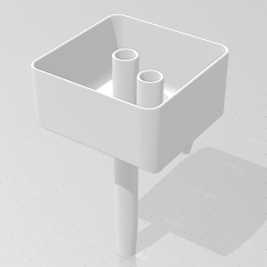

# 项目说明

本项目是一个 3D 模型的设计，是一个猫咪饮水器的扩展配件装置，名为【细水长流】。

猫咪饮水器原本的进水口是直接喷水的，每次感应喷水 15 秒（约 200mL），水流比较大，本装置将其改造为细小的水流，并延长出水时间。

采用 Autodesk Fusion 360 作为设计工具。

# 主要结构

- A - 蓄水箱
- B - 进水管
- C - 溢水管
- D - 出水口

# 关键结构参数

- 蓄水箱容积 >200mL，底面悬高 100mm
- 溢水管上沿比蓄水箱上沿低 10mm
- 进水管与出水口轴距 50mm
- 进水管下端为倒圆台形，长度 30，大外径 18，小外径 15
- 出水口内径 2

# 设计步骤

1. 创建 A/B/C/D 的实心物体，并摆好位置。

    - A: 长 100 × 宽 100 × 高 40+10
    - B: 圆柱高 150，大外径 18，圆台高 30，小外径 15
    - C: 高 50，外径 18，下端探出 10
    - D: 高 10，大外径 10，小外径 6

2. A 的三条底边和四条立边做圆角 10，A := A + D，抽壳 2。

3. B 和 C 抽壳 2，并在 A 上钻孔，A := A + B + C。

4. 所有棱线做圆角 1。
